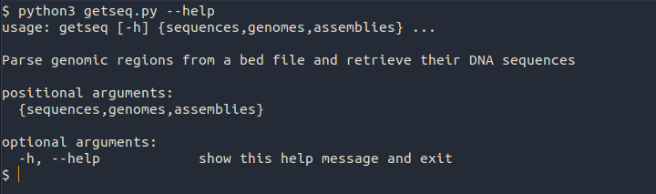
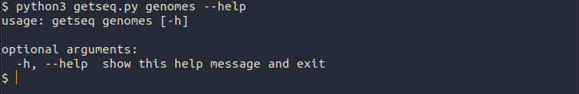
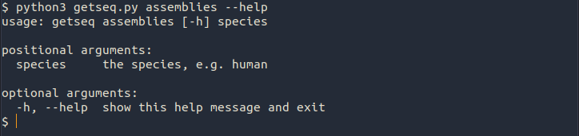

# GetSeq

GetSeq parses genomic regions from a bed file and retrieves their DNA sequences from Ensembl using their REST API.

### Features

- Recognises and checks for headers in the bed file.
- Processes both UCSC chromosome annotation (i.e. `chr` prefix) and Ensembl chromosome annotation.
- Extends requested regions upstream and/or downstream.
- Accepts `stdin` as input and outputs to `stdout` for easy piping from and into other programmes.
- Respects the limitations of each request dictated by the API.

### Requirments

* Python 3 or higher

- pandas, e.g. `pip install pandas`
- requests, e.g. `pip install requests`

### Commands

* GetSeq has three subcommands: `sequences`, `genomes`, and `assemblies`

#### sequences

* the main sub-command which parses the passed genome regions and retrieves their DNA sequences from Ensembl.

  It is possible to define a number of base pairs (bp) to extend the sequence upstream/downstream

In the following example, getseq.py was used to retrieve the DNA sequences from `Sample1_GRCh38.bed` with the optionally extended regions upstream `-u 100` and downstream `-d 10` . The output file was saved as `Sample1_GRCh38.fa` .

It's also possible to stream the regions through `stdin` where no `-b` option is provided as in the following example. Notice that getseq detected the header in the `Sample2_GRCh38.bed` file.

Here is another example where getseq directs the output to `stdout` instead of `-o` output file. This to allow piping into another programme. Notice that optional log file `-l Sample3_hg19.log`. Also, notice that getseq handled the UCSC chromosome annotation, i.e. `chr` prefix.

* The final example shows that even when a log file option was not specified, getseq saved the log to a file called `getseq.log`. This file gets overwritten on every run, so if it is desirable to keep the `.log` file, then the option `-l` should be specified.

Notice that getseq does not output any of the log messages into the redirected `stdout`.

#### genomes

* This subcommand is used to list available genomes from Ensembl

#### assemblies

* This subcommand is used to list available assemblies for each species from Ensembl

